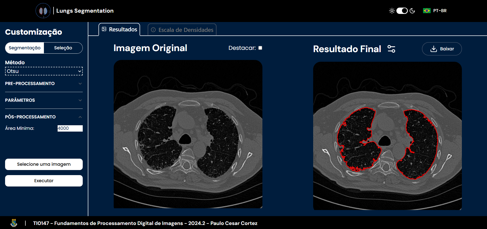

# Lung Segmentation App

## Overview

This project is a **lung segmentation application** built with React, TypeScript, TailwindCSS, and ShadCN UI. It allows users to upload **DICOM** (.dcm) files, configure segmentation parameters, and send the data to an API for preprocessing, segmentation, and post-processing. Users can also manually edit segmentations, zoom in on images, and **download results**.

## Preview



## Features

✅ Upload **DICOM (.dcm) files**

✅ Select **segmentation methods** (Otsu, Watershed, Sauvola, etc.)

✅ Configure **preprocessing, segmentation, and post-processing parameters**

✅ **Light/Dark** mode support

✅ **Portuguese/English** translation

✅ **Manual segmentation** (drawing over images)

✅ **Zoom in/out** for better visualization

✅ Download **segmentation results** as:

- **Contours (CSV)**

- **Segmented image (PNG)**

## Tech Stack

- **Frontend**: React Vite + TypeScript

- **Styling**: TailwindCSS + ShadCN UI

- **HTTP Requests**: Axios

## API Integration

The app sends requests to a separate backend API with:

- DICOM file

- Preprocessing, segmentation, and post-processing parameters (as JSON)

- Segmentation method (query parameter)

**API Response**:

- Preprocessed image (before segmentation)

- All detected contours

- Valid contours (adjusted by post-processing parameters)

## Installation & Setup

1. Clone the repository
   ```bash
   git clone https://github.com/ProjetoFinalPDI/frontend.git
   cd frontend
   ```
2. Install dependencies

   ```bash
   npm install
   ```

3. Start the development server

   ```bash
   npm run dev
   ```

## Usage

1. Upload a DICOM file (.dcm)

2. Configure segmentation settings

3. Select the segmentation method

4. View and download segmentation results
